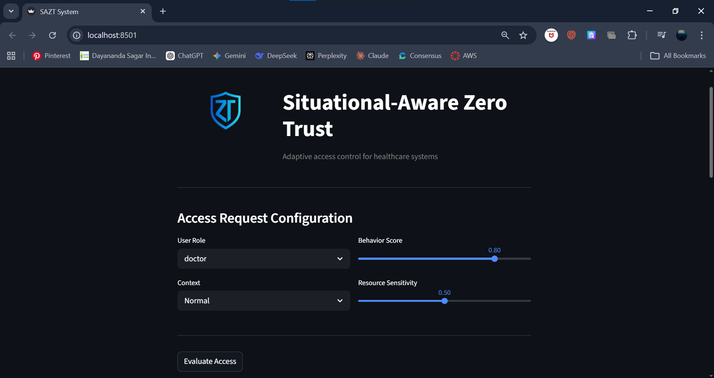
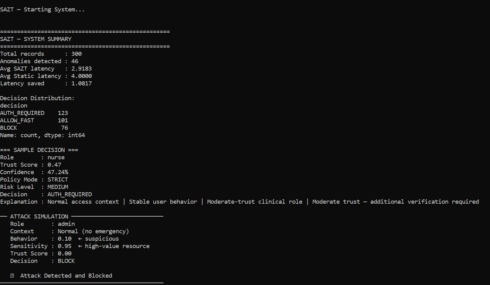
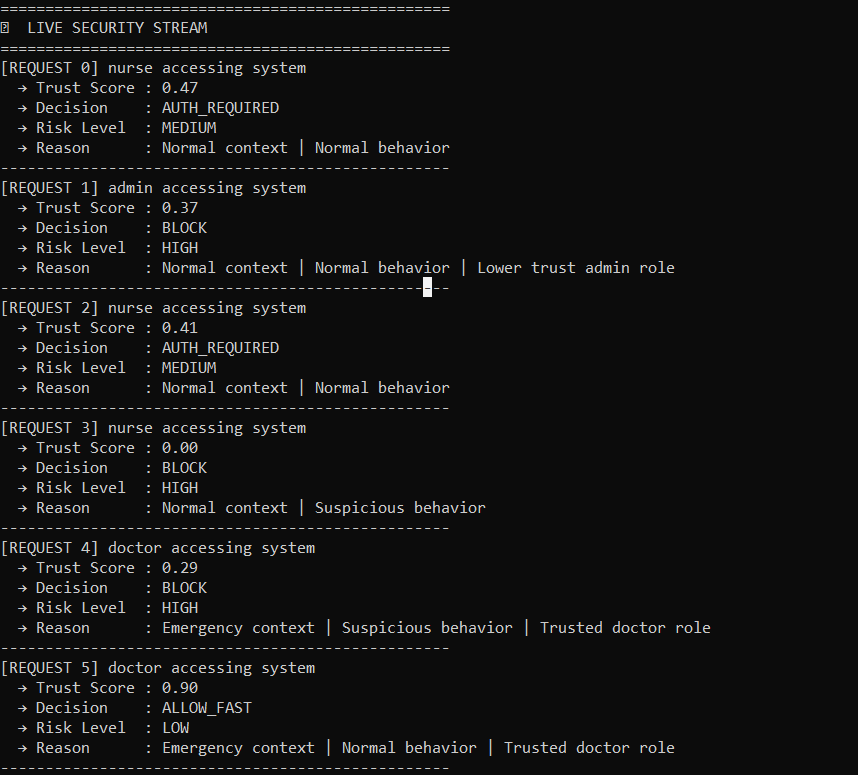
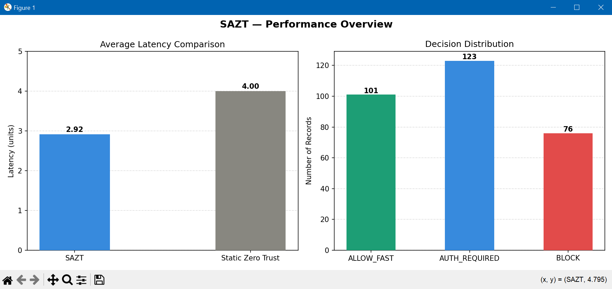

# Situational-Aware Zero Trust (SAZT)

A dynamic Zero Trust system that evaluates access requests using real-time context, user behavior, and resource sensitivity, designed for healthcare environments.

---

## Overview

Traditional access control systems are static and fail to adapt to time-critical environments such as healthcare.

This project introduces Situational-Aware Zero Trust (SAZT), a context-aware security model that dynamically computes trust for each access request and adjusts decisions in real time.

---

## Key Features

* Dynamic trust score computation
* Context-aware access control (Emergency vs Normal)
* Behavioral risk analysis with anomaly detection
* Policy-based decision engine
* Explainable decision outputs
* Interactive web interface using Streamlit
* Real-time logging (CLI and UI)
* Attack simulation module
* Interactive demo mode for testing scenarios

---

## How It Works

The system computes a trust score using:

* Context (Emergency or Normal)
* Behavior score
* User role weight
* Resource sensitivity

Trust Score =
0.4 × Context +
0.3 × Behavior +
0.2 × Role +
0.1 × (1 - Sensitivity)

If anomalous behavior is detected, a penalty is applied to reduce the trust score.

---

## Decision Logic

| Trust Score | Decision                |
| ----------- | ----------------------- |
| > 0.7       | Allow                   |
| 0.4 – 0.7   | Authentication Required |
| < 0.4       | Block                   |

---

## Emergency Override

In emergency scenarios, low-trust requests may still be permitted with monitoring enabled. This ensures that security controls do not delay critical medical actions while maintaining auditability.

---

## System Architecture

### Core Engine

* Synthetic dataset generation
* Trust score computation
* Decision and risk classification
* Latency comparison
* Explanation generation

### Interactive UI

* Manual simulation of access requests
* Real-time evaluation and decision output
* Emergency override handling
* Live logging

### CLI Execution

* Full pipeline execution
* Dataset processing
* Summary and sample output
* Attack simulation
* Live security logs
* Interactive demo mode

---

## Project Structure
```
SAZT-System/

├── app.py
├── main.py
├── trust_engine.py
├── dataset_generator.py
├── attack_simulator.py
├── visualization.py
├── requirements.txt

├── ui.png
├── terminal.png
├── charts.png
├── logs.png

└── README.md
```
---

## Screenshots

### User Interface



### System Execution (Terminal)



### Live Security Logs



### Performance Visualization



---

## Installation

```bash
git clone
https://github.com/sanjanajirankali
/SAZT-System.git
cd SAZT-System
pip install -r requirements.txt
```
---

## Usage

### Run the automated system

python main.py

### Run the interactive interface

python -m streamlit run app.py

---

## Output

* Evaluated dataset (sazt_output.csv)
* Performance comparison charts
* Real-time logs
* Decision explanations

---

## Attack Simulation

The system includes a predefined attack scenario involving:

* Administrative user
* Low behavior score
* High sensitivity resource

The system evaluates the request and blocks access when risk is detected.

---

## Demo Mode

The CLI includes an interactive demo mode that allows:

* Selection of policy modes (Strict, Balanced, Emergency-first)
* Simulation of different access scenarios
* Custom input testing

---

## Conclusion

SAZT demonstrates how adaptive, context-aware Zero Trust models can improve both security and usability in critical environments.

It highlights the importance of dynamic trust evaluation, explainable decisions, and real-time adaptability in modern access control systems.

---

## Author

Cybersecurity project focused on adaptive Zero Trust architectures.
